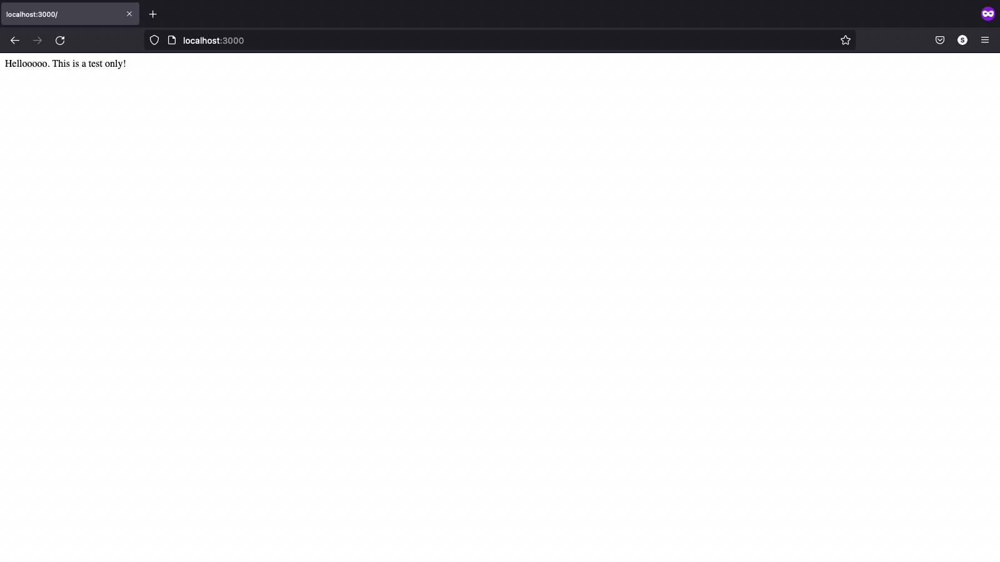
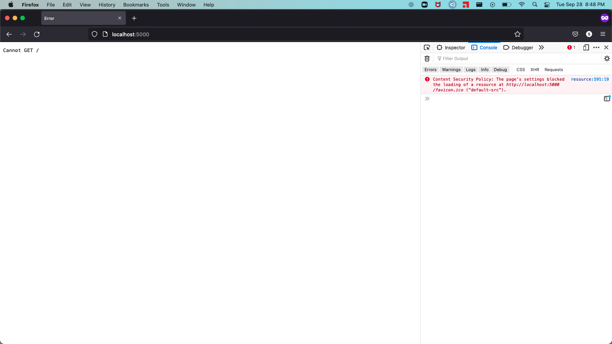

# Personal Notes!

## Things to do

- [x] Set up TypeScript Express Server
- [ ] Set up API functionalities
- [ ] Set up ORM (typeORM) and connect database

## How I Started my Project

- created a github repository, cloned it to local
- wrote a README file
- create gitignore file
- initialized a nodeJS project using `npm init`
    - filled up initial `package.json` information via `npm init`
- installed TypeScript as a dev dependency using `npm install -D typescript`
- create application endpoint at `src/index.ts`
- create `tsconfig.json` using `npx tsc --init`
    - followed `tsconfig.json` from a previous sprint
- ts compiler: `npx tsc --watch`
- install express `npm i express && npm i -D @types/express`
    - create initial express app to test if working
    ```
        import express from 'express';
        const app = express();

        app.get('/', (req, res) => {
            res.send('Hellooooo')
        });

        const port = process.env.PORT || 3000;

        app.listen(port, () => console.log(`App listening on PORT ${port}`));
    ```
- update npm scripts in `package.json`
    ```
        "start": "node dist/index.js",
        "dev": "tsc -w & nodemon dist/index.js"
    ```



## Mimicking ORM sprint

- create express app instance
    - copied `index.ts` and `app.ts` from previous sprint
    - removed unwanted imports to make it work
    - no default `GET` method yet, but it connects


- connect to psql using `typeorm`
    - installed `typeorm`, `type-seeding`, `pg`, `dotenv`, `ts-node`
    - copied `scripts/testConnection`, `database.ts`, `ormconfig`
    - created `.env` for psql environment variables

- creating `Home` service
    - create `index.ts` that exports the controller and manager
    - create `controller.ts` that handles the REST API endpoints
    - create `manager.ts` that handles the data or other functions
- repeat for creating other serices

## Seeding Data

- create an Entity
- copy npm scripts for orm
    ```
    "orm": "ts-node -r dotenv/config ./node_modules/typeorm/cli.js --config src/ormconfig.ts",
    "makeMigrations": "npm run orm -- migration:generate -n",
    "migrate": "npm run orm -- migration:run",
    "rollback": "npm run orm -- migration:revert",
    "seeder": "ts-node -r dotenv/config ./node_modules/typeorm-seeding/dist/cli.js",
    "seed": "npm run seeder -- --configName src/ormconfig.ts seed"
    ```
- prepare seeds
- do migrations with `npm run makeMigration <migrationFileName>` and `npm run migrate`
- seed using `npm run seed`

### Resources

- [How to Build A REST API with ExpressJS and TypeScript](https://medium.com/swlh/build-a-rest-api-with-express-js-and-typescript-dc2c8da89c52)